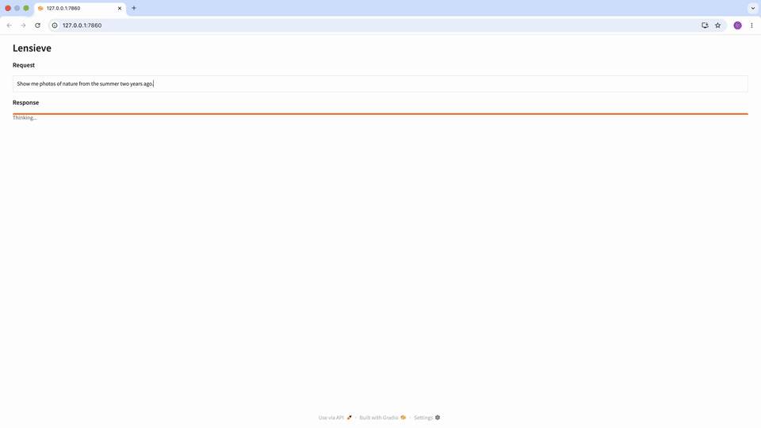

# Lensieve



Lensieve is a local, privacy-first tool for semantic search over personal photo collections.  
It runs entirely offline and does not require external services.

The project is currently at an MVP stage. It supports free-form text queries with optional time references, for example:

`Show me photos of nature from last summer`

Results can be grouped by visual similarity in the UI.

The full pipeline (ingestion and search) can run on CPU-only machines, though performance will be slower compared to hardware-accelerated setups.

## Planned Features

- Querying image metadata (e.g. date, camera)
- Search by image
- Face-based search
- Support for video files and animated images (e.g. GIFs)
- Location-based search
- Grouping photos by trips or events

## Setup

### 1. Install uv

Install `uv`: https://github.com/astral-sh/uv

### 2. Create the environment:

```bash
uv sync
```

#### Linux notes

Most dependencies work out of the box on Linux. On some systems, additional packages may be required:

```bash
sudo apt-get install libraw-dev libheif-dev libde265-dev
```

This is mainly needed for RAW image support (`rawpy`) and HEIF/HEIC images.

#### Hardware acceleration

By default, `uv sync` installs the standard `llama-cpp-python` package, which runs on CPU.

To rebuild `llama-cpp-python` with hardware acceleration, run one of the following commands after `uv sync`.

**macOS (Apple Silicon):**
```bash
CMAKE_ARGS="-DLLAMA_METAL=on" uv sync --reinstall-package llama-cpp-python
```

**Linux (NVIDIA CUDA):**
```bash
CMAKE_ARGS="-DGGML_CUDA=on" uv sync --reinstall-package llama-cpp-python
```

#### Development (optional)

To work on the codebase, install development dependencies:

```bash
uv sync --group dev
```

This includes tools for:

- Linting and formatting (`ruff`)
- Notebooks (`jupyterlab`, `ipywidgets`)
- Notebook diffing (`nbdime`)

### 3. Configure Lensieve

Edit `configs/config.yaml` and set `root` to your image directory.

- Nested directories are supported  
- Duplicate filenames across directories are allowed  
- Multiple image formats are supported  
- Video files and animated images (e.g. GIFs) are not supported 

You may also adjust model selection depending on your hardware.

### 4. Download models

```bash
uv run python src/lensieve/cli/download_models.py
```

## Ingestion

Process images and build the index:

```bash
uv run python src/lensieve/cli/ingest.py
```

## Run

Start the UI:

```bash
uv run python src/lensieve/cli/run_gradio.py
```

Enter a query, review results, and group similar images.